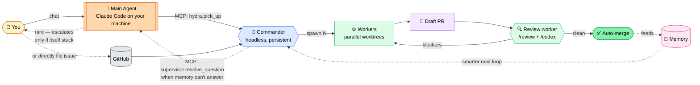
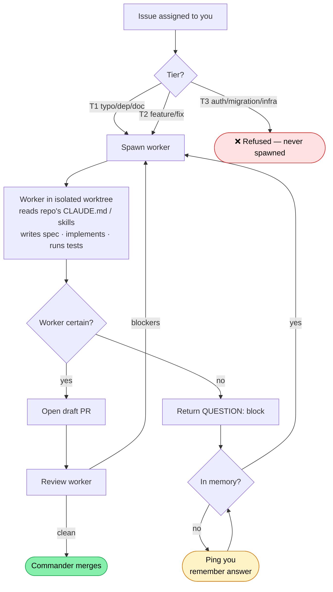

# Hydra

[](https://github.com/tonychang04/hydra/actions/workflows/ci.yml)
[](LICENSE)
[](https://github.com/tonychang04/hydra/releases)
[](#)
[](https://claude.com/claude-code)
[](DEVELOPING.md)
[](https://github.com/tonychang04/hydra/issues)
[](https://github.com/tonychang04/hydra/commits/main)
[](https://github.com/tonychang04/hydra/stargazers)

**An auto-machine that clears your ticket queue while you sleep.**

You file a GitHub issue and assign it to yourself. Hydra picks it up, reads the repo, writes the code, runs the tests, reviews its own PR, and merges it. You wake up to a queue of merged PRs. Every loop makes Hydra smarter: patterns become memory, recurring memory becomes repo-native skills, answered questions become auto-answers.

Built on [Claude Code subagents](https://code.claude.com/docs/en/sub-agents) + [superpowers skills](https://github.com/anthropics/superpowers). MIT licensed. Self-hosted (your laptop today, cloud tomorrow).

## Who's who (read this first)

Four roles, three of them agents. Keep them straight and the rest of the docs click.

| Role | What it is | Where it runs | Who it talks to |
|---|---|---|---|
| **You** (human) | The person. You don't run any Hydra code. You just file issues + chat with your Main Agent. | In front of a screen | Main Agent |
| **Main Agent** (AI) | Your primary assistant. Claude Code on your laptop, or a cloud-hosted Claude session. **This is the only agent YOU talk to.** It decides when to call Hydra. | Your laptop (or wherever you run Claude Code) | You (chat) + Hydra Commander (MCP) |
| **Commander** (AI) | Hydra's persistent brain. Long-running agent that picks up tickets, spawns workers, tracks state, manages memory. **Headless in cloud mode** — no chat surface. | Your laptop (local mode) or cloud VPS (cloud mode) | Main Agent (MCP) + Workers (Agent tool) |
| **Worker** (AI) | Ephemeral Claude subagent, one per ticket. Runs inside an isolated git worktree. Reads the ticket, writes the code, opens the PR, dies. | Same machine as Commander (spawned by Commander) | Commander (via Agent tool return + SendMessage) |

**Trigger chain for one ticket:**

`You → Main Agent → Commander → Worker → GitHub (PR) → Commander (merges) → memory updated`

**Ask-back chain when a Worker gets stuck:**

`Worker → Commander → (memory hit? resolved) → Main Agent → (main agent decides, maybe asks You) → answer flows back down`

**Common confusion points:**

- "Is Commander the same as Main Agent?" — **No.** Main Agent is yours (Claude Code on your laptop). Commander is Hydra's. They talk to each other over MCP.
- "Is Worker the same as Subagent?" — Yes. "Worker" is Hydra's name for the role; "subagent" is Claude Code's name for the mechanism. Same thing.
- "Who does 'Operator' refer to in old docs?" — Historically "Operator" meant You-the-human, but sometimes meant "your Main Agent". We're phasing "Operator" out in favor of the four precise terms above.

## Try it in 10 minutes

Want to see the full Hydra loop end-to-end before wiring it into your own repos? A runnable demo lives at [`examples/hello-hydra-demo/`](examples/hello-hydra-demo/). It's a minimal zero-dep Node package plus three fixture GitHub issues that exercise the three tier outcomes — one T1 auto-merge, one T2 human-merge, one T3 refusal — in about ten minutes of wall-clock.

Walkthrough: **[examples/hello-hydra-demo/DEMO.md](examples/hello-hydra-demo/DEMO.md)**

No `npm install` required. No config beyond adding the forked repo to `state/repos.json`. By the end you'll have two PRs merged, one issue refused, and a `memory/learnings-hello-hydra-demo.md` file showing what the worker captured — the seed of the learning loop.

## The loop



Read it left-to-right. **Solid line = happy path** (no human). **Dashed = learning or escalation.** The only time the loop touches you is when memory genuinely can't answer — and that answer is then captured so it won't touch you next time for the same thing.

## Inside one iteration



Every box that ends an arrow is a terminal state: **refused**, **ping operator** (rare), or **merged**. The `FAQ` loop is the learning heart — if Commander has seen a similar question before, it answers itself.

## The learning loop (TL;DR — this is the magic)

Every time Hydra gets stuck, it learns once and never asks again.

```
Worker hits a gotcha mid-ticket
        │
        ▼
  QUESTION: block
        │
        ▼
Commander checks memory/escalation-faq.md
        │
    ┌───┴───┐
    │       │
  MATCH?   no match
    │       │
    │       ▼
    │   Calls SUPERVISOR agent (main agent / you)
    │       │
    │       ▼
    │   Supervisor answers
    │       │
    │       ▼
    │   Commander appends Q+A to memory/escalation-faq.md
    │       │
    ▼       ▼
Commander SendMessage(worker, answer) — worker resumes
        │
        ▼
Ticket ships, PR merges
```

**The second time any worker hits the same gotcha, Commander answers in milliseconds from memory. The supervisor never sees it. You never see it.**

Concrete: `npm test hangs with no output` fires once → supervisor says `add a postcss.config.cjs stub, delete before commit` → captured → from that moment on, every worker across every repo that hits the same thing auto-resolves without human attention. The loop gets quieter every day.

Three kinds of things "ask back":

| Who asks | Who answers | When | Frequency over time |
|---|---|---|---|
| Worker | Commander | Mid-ticket uncertainty | Per-ticket (constant) |
| Commander | Your main agent (MCP) | Memory can't match | Goes down as memory grows |
| Main agent | You (human) | Main agent can't decide | Rare, getting rarer |

The bottom row — the only layer that touches you — shrinks every week as memory compounds. That's the point.

## What Hydra IS

- **An auto-machine.** Default mode is hands-off. Autopickup polls GitHub every N minutes. You chat with Commander only to steer, not to dispatch.
- **Parallel.** N workers in flight at once, each isolated in its own git worktree. One Mac today, N cloud sandboxes tomorrow.
- **Self-testing.** Workers discover how to test a repo (docker-compose, .env.example, Makefile). The same primitive runs regression tests against the Hydra framework itself.
- **Learning.** Every completed ticket contributes citations. Consistent patterns graduate out of Commander's memory and into repo-native skills.
- **Self-hosting.** Hydra is a regular GitHub repo; you can add `tonychang04/hydra` to your Hydra's `state/repos.json` and let workers improve Hydra. Dogfood is the default test.

## What Hydra is NOT

- A chat assistant (only the commands listed below).
- A plan-review gauntlet (no CEO / design / DX / eng plan reviews — use gstack for that).
- A deploy controller (stops at merge; CI + your deploy infra handle the rest).
- A replacement for human judgment on security or production risk (T3 = refuse).

## How Hydra compares

If you've used Dependabot, Aider, GitHub Copilot Workspace, or the Codex CLI, here's where Hydra fits:

| | Hydra | Dependabot | Aider | Copilot Workspace | Codex CLI |
|---|---|---|---|---|---|
| **Scope** | general tickets (GitHub Issues, Linear next) | dependency updates only | interactive code edits | GitHub issue implementation | interactive code gen |
| **Trigger** | auto (autopickup) or manual `pick up` | schedule or PR event | human-invoked | human-invoked | human-invoked |
| **Parallelism** | N workers concurrently (`max_concurrent_workers`, default 3) | 1 PR per dep | 1 session | 1 issue at a time | 1 session |
| **Autonomy** | auto-merge after review-clean (T1; T2 configurable) | auto-merge opt-in | human merges | human merges | human merges |
| **Learns over time** | yes (memory + citations + skill promotion) | no | no | no | no |
| **Self-hosted** | yes — your laptop or cloud VPS | SaaS (GitHub) | self (runs locally) | SaaS (GitHub) | self (runs locally) |
| **Cost model** | subscription (Claude Max) or API (Phase 2) | free | API pay-as-you-go | subscription | API |
| **Isolation** | git worktrees | runs on GitHub infra | none (edits your working tree) | GitHub Codespaces | none (edits your working tree) |
| **Safety tiers** | T1 / T2 / T3-refuse (see below) | n/a | n/a | n/a | n/a |
| **Learning from other workers** | planned ([#21](https://github.com/tonychang04/hydra/issues/21) peer help) | no | no | no | no |

Competitor cells reflect the worker's understanding of each tool's documented behavior as of **2026-04-16**. Tools in this space evolve fast; expect this table to be revisited roughly every six months. If you spot a cell that's out of date, file an issue — a one-cell fix is welcome.

**Where Hydra wins:** general-purpose parallel ticket clearing that learns from every PR it ships. The row that's hardest for any other tool to match is *learns over time* — the memory → citation → skill-promotion pipeline is the reason the loop gets quieter every week. Everything else in the table is table stakes or a deliberate design choice (self-hosted, isolated, tiered-safety).

**Where Hydra loses:**

- **Pure dependency bumps** — Dependabot is more specialized, battle-tested, and free. If all you need is `foo@1.2.3 → foo@1.2.4`, use Dependabot. (Hydra can still handle a dep bump as a T1 ticket if you prefer one tool; it just isn't the best-in-class option for that workload.)
- **Interactive single-file edits with human in the loop at every step** — Aider and Codex CLI are better if you want to drive the edit yourself turn by turn. Hydra is built for walk-away async work, not live pair programming.
- **Zero-config, pre-integrated with GitHub's UI** — Copilot Workspace is already inside GitHub; there's nothing to install. Hydra is self-hosted, which is power and responsibility both.

The niche Hydra owns: **walk-away parallel ticket clearing that compounds a learning loop across repos**. That's not what any of the other tools are built for.

## Risk tiers (keep Hydra safe to leave running)

| Tier | Scope | Who merges |
|---|---|---|
| **T1** | Typo fixes, doc changes, dep patch bumps, pure test additions | Commander, after CI green |
| **T2** | Feature work, bug fixes, refactors | Commander (after review-worker clears it) — configurable per repo |
| **T3** | Auth, migrations, infra, `.github/workflows/*`, secrets, anything matching `*auth*`/`*security*`/`*crypto*` | Nobody — Commander refuses the ticket |

Per-repo override in `state/repos.json` (e.g. Hydra self-hosted defaults `{T1: human, T2: human}` because framework changes are high-impact).

## Install

**One-liner** (clones to `~/hydra`, runs setup, drops you at the launcher):

```bash
curl -fsSL https://raw.githubusercontent.com/tonychang04/hydra/main/install.sh | bash
```

**Or manually:**

```bash
git clone https://github.com/tonychang04/hydra.git
cd hydra
./setup.sh
./hydra
```

Full install reference (prereqs, troubleshooting, updating, uninstall): **[INSTALL.md](INSTALL.md)**

After install, also install the Main Agent skill: `cp -r skills/hydra-operator ~/.claude/skills/` — teaches your Claude Code when to invoke Hydra's MCP tools. See [`skills/hydra-operator/README.md`](skills/hydra-operator/README.md).

### Verify install

After install, run `./hydra doctor` to verify your setup. All ✓'s means you're ready to pick up tickets. It runs a battery of non-destructive checks across environment, config, runtime state, memory, and scripts, prints per-check pass/fail, and exits non-zero if any check fails. Pass `--verbose` for raw command output or `--fix-safe` to attempt safe auto-remediations (chmod +x, mkdir -p).

### CLI commands (no chat required)

Daily operations and repo management are exposed as `./hydra <subcommand>` calls that never launch a Claude session. Safe for shell scripts, cron, SSH, and muscle-memory ops. Spec: [`docs/specs/2026-04-16-hydra-cli.md`](docs/specs/2026-04-16-hydra-cli.md).

| Command | What it does |
|---|---|
| `./hydra doctor [--verbose]` | Install sanity check. Non-destructive. |
| `./hydra status [--with-tickets]` | Read-only snapshot: active workers, today's throughput, autopickup state, PAUSE, pending queue. |
| `./hydra add-repo <owner>/<name>` | Interactive wizard to add a repo to `state/repos.json`. Auto-suggests `local_path`, validates, atomic-writes. `--force` to overwrite an existing entry. |
| `./hydra remove-repo <owner>/<name>` | Remove a repo entry from `state/repos.json`. |
| `./hydra list-repos` | Table view of configured repos. |
| `./hydra pause [--reason <text>]` | Create the `PAUSE` file. Commander refuses to spawn new workers while present. |
| `./hydra resume` | Remove the `PAUSE` file. |
| `./hydra issue <url-or-owner/repo/num>` | Queue a specific GitHub issue for the next autopickup tick. Does NOT spawn a worker — adds to `state/pending-dispatches.json` (gitignored). |

All subcommands work from any terminal without Commander chat.

**Two paths from here:**
- You want to **use Hydra on your own repos** → **[USING.md](USING.md)**
- You want to **contribute to Hydra itself** → **[DEVELOPING.md](DEVELOPING.md)**

No labels required up-front. Commander creates the handful of state labels it uses (`commander-working`, `commander-review`, `commander-stuck`, etc.) lazily on first use.

## How tickets reach the commander

Two trigger modes, configurable per repo in `state/repos.json`:

**Default: assignee trigger**
Assign an issue to yourself (the `gh auth`'d user). Commander polls `gh issue list --assignee @me` and picks it up. Simplest UX — no labels, no extra step. Use this if "assigned to me" naturally means "please take this."

**Alternative: label trigger**
If "assigned to me" is already your personal in-progress field, set `"ticket_trigger": "label"` on a repo. Then commander picks up only issues labeled `commander-ready`. More explicit, slightly more friction.

**Linear (Phase 2):** same shape — assign to the commander's Linear user, OR set a specific status/state like "Ready for commander". Configured per Linear team in `state/linear.json` (coming in Phase 2).

The session loads `CLAUDE.md` as its system prompt, greets you with queue status, and waits. Try `status`, then `show me 3 ready tickets` (inspection only), then `pick up 1` for a real run.

## Mental model

```
You (chat) ──────────────────────────────────────────────┐
                                                         │
Commander (the body: this dir's long-lived claude session)│ ← operator asks
  │                                                      │   question only
  ├─ reads MEMORY.md, policy.md, budget.json             │   when memory
  ├─ polls GitHub issues (label: commander-ready)        │   can't resolve
  ├─ classifies tier (T1 auto-merge / T2 human-merge     │
  │                   / T3 refuse)                       │
  │                                                      │
  ├─ Agent(subagent_type="worker-implementation",        │
  │        isolation="worktree")  ──┐                    │
  │                                 │                    │
  │                                 ▼                    │
  │                       Head (one of many workers —    │
  │                       fresh context, own worktree,   │
  │                       own memory, own permission     │
  │                       scope, short-lived)            │
  │                         ↓                            │
  │                       Reads repo's CLAUDE.md /       │
  │                       AGENTS.md / .claude/skills/    │
  │                         ↓                            │
  │                       brainstorming → plan → TDD     │
  │                         ↓                            │
  │                       Runs tests (docker if needed)  │
  │                         ↓                            │
  │                       /review → /codex review        │
  │                         ↓                            │
  │                       Opens draft PR → labels issue  │
  │                                                      │
  ├─ Agent(subagent_type="worker-review",                │
  │        isolation="worktree")                         │
  │     (runs against the worker's new PR before         │
  │      surfacing to human for merge)                   │
  │                                                      │
  └─ QUESTION: block from a worker ─────────────────────>┘
        (surfaced in chat with nearest memory precedent)
```

## Three worker types (defined in `.claude/agents/`)

| Type | When | Never does |
|---|---|---|
| `worker-implementation` | Any ticket with code changes | Review / discovery |
| `worker-review` | After a PR opens, before human merge gate | Code changes |
| `worker-test-discovery` | When a repo has no working documented test procedure | Source changes |

Each is a proper Claude Code subagent definition (YAML frontmatter with `isolation: worktree`, `memory: project`, `maxTurns`, `skills:` preload, `color:`).

## Chat reference

| You say | Commander does |
|---|---|
| `status` | Summary of running workers + today's quota |
| `show me N ready tickets` | Inspect without spawning |
| `pick up N` | Spawn up to N implementation workers |
| `pick up #42` | Target a specific ticket |
| `review PR #501` | Spawn a review worker on an existing PR |
| `test discover <repo>` | Figure out how to test a repo, commit the docs |
| `classify <ticket text>` | Dry-run the tier classifier |
| `retry #42` | Re-spawn with prior failure as hint |
| `undo #501` | Revert a previously-merged commander PR (within 72h) |
| `pause` / `resume` | Toggle `PAUSE` kill switch |
| `kill <id>` | Stop a runaway worker |
| `merge #501` | T1 auto-merge; T2 requires explicit confirm; T3 refused |
| `reject #501 reason: ...` | Close PR, label `commander-rejected` |
| `quota` / `cost today` | Tickets done + wall-clock + rate-limit health |
| `self-test` | Run the regression harness on golden closed PRs |
| `compact memory` / `promote learnings` | Manual memory hygiene pass |
| `answer #42: <guidance>` | Resolve a paused worker's question |

## Safety layers

1. **Worktree FS isolation** — workers can't see siblings or your home dir
2. **Scoped permission profile** — no `curl` to external URLs, no `rm -rf`, no `sudo`, no reads of `.ssh`/`.aws`/real `.env*`, no self-modification of commander's own CLAUDE.md / policy / settings
3. **Tier 3 refusal** — `policy.md` enumerates paths (auth, migration, infra, secrets, workflows) that refuse outright
4. **Wall-clock cap** — each worker self-terminates past the budget's limit
5. **Concurrency cap** — default 3 workers to prevent rate-limit exhaustion
6. **PAUSE kill switch** — `touch PAUSE` halts all new spawns
7. **Merge gate** — T1 may auto-merge on CI green; T2 always requires human confirm; T3 refused
8. **Rate-limit auto-pause** — auto-pauses 1hr on rate-limit error

## Staged rollout (don't skip)

See `docs/superpowers/specs/2026-04-16-commander-agent-design.md` for the full spec.

- **Rung 1 — smoke test (5 min):** launch, verify state files parse, classify a few test tickets. No spawning.
- **Rung 2 — Stage 0 (30-60 min):** one small already-merged PR, compare worker's diff to the real one
- **Rung 3 — Stage 1 (2 hr):** three closed PRs in parallel, watch label locks
- **Rung 4 — Stage 2 (48 hr):** label real open tickets `commander-dryrun`, walk away, review next morning
- **Rung 5:** graduate T1 auto-merge + full throughput

## Memory & learning

Project-specific knowledge (what works in each repo) lives in `memory/` and is **gitignored** — never committed to this public repo. You keep your own learnings local.

- `memory/MEMORY.md` — index (committed as template)
- `memory/escalation-faq.md` — generic answers to recurring worker questions (committed; framework-level)
- `memory/memory-lifecycle.md` — rules for compaction + promotion (committed)
- `memory/learnings-<repo>.md` — **gitignored**; your per-repo gotchas
- `memory/archive/` — **gitignored**; compacted older entries
- `state/*.json` — **gitignored**; live runtime state
- `logs/*` — **gitignored**; per-ticket audit trail

**Phase 2 knowledge store:** `memory/` and `state/` graduate to S3 (via S3 Files filesystem mount), so multiple commander instances share learnings. See `docs/phase2-s3-knowledge-store.md`.

## Self-test

Changes to your `CLAUDE.md` / worker subagents / `policy.md` can regress worker behavior. The self-test harness runs the commander against golden closed PRs and compares output.

```
self-test            # run all golden cases
self-test <case-id>  # one case
self-test --parallel # up to max_concurrent_workers in parallel
```

Golden cases live in `self-test/golden-cases.json` (gitignored; you populate from your own validated Stage 0 runs). Template: `self-test/golden-cases.example.json`.

## Spec-driven (non-trivial changes need a spec)

Every non-trivial change to Hydra — new worker type, policy rule, memory-lifecycle rule, ticket-source adapter — writes a short spec in `docs/specs/YYYY-MM-DD-<slug>.md` **before** code. The spec lives alongside the implementation PR forever, explaining **why** the decision was made. See `docs/specs/README.md` + `docs/specs/TEMPLATE.md`.

This is the compounding "why" memory of the repo. When the next contributor (human or Hydra worker) looks at a file and wonders "why is this like this", the spec is there. Code tells you what; specs tell you why.

Workers enforce this at spec scope:
- Trivial change (typo, dep patch, comment edit): no spec required
- Anything else: `worker-implementation` writes the spec first, commits it, then implements against it

## Hydra builds Hydra (self-hosting)

Hydra is a regular GitHub repo. Which means: **one Hydra instance can work on Hydra AND on your external repos at the same time.**

The `state/repos.json` template already includes a dogfood entry for `tonychang04/hydra` — just flip `enabled: true` and point `local_path` at your clone. Your Commander session then polls BOTH:

- Tickets assigned to you in `tonychang04/hydra` (or your fork) → worker head writes a spec + implements against Hydra itself
- Tickets assigned to you in `your-org/your-repo` → worker head clears tickets in your normal codebase

Parallelism doesn't care about repo boundaries. If you have 5 tickets ready across 3 repos and `max_concurrent_workers: 3`, you'll get 3 workers in parallel — some on hydra, some on your repos, whichever got picked up first.

Why this matters:
- Every improvement to Hydra goes through Hydra's own process — proves the system works
- Specs in `docs/specs/` become self-documenting history of why Hydra is the way it is
- You can file aspirational tickets ("support Jira", "add circuit-breaker for repeated stuck workers") on the hydra repo AND let Hydra attempt them alongside your normal ticket queue
- Worst case on a self-hosted ticket: `commander-stuck` label + a `QUESTION:` block in your chat next morning

See **[DEVELOPING.md](DEVELOPING.md)** for the full contributor flow.

## Files

```
commander/
├── CLAUDE.md                              commander's operating loop (committed)
├── README.md                              this file (committed)
├── LICENSE                                MIT (committed)
├── policy.md                              risk-tier rules (committed; tune locally)
├── budget.json                            concurrency + wall-clock caps (committed; tune locally)
├── .claude/
│   ├── settings.local.json                permissions (GITIGNORED — copy from .example)
│   ├── settings.local.json.example        template (committed)
│   └── agents/
│       ├── worker-implementation.md       (committed)
│       ├── worker-review.md               (committed)
│       └── worker-test-discovery.md       (committed)
├── state/
│   ├── repos.json                         your repos (GITIGNORED)
│   ├── repos.example.json                 template (committed)
│   ├── active.json                        runtime (GITIGNORED)
│   ├── budget-used.json                   runtime (GITIGNORED)
│   └── memory-citations.json              runtime (GITIGNORED)
├── memory/
│   ├── MEMORY.md                          index (committed)
│   ├── escalation-faq.md                  generic Q&A (committed)
│   ├── memory-lifecycle.md                rules (committed)
│   ├── tier-edge-cases.md                 stub (committed)
│   ├── worker-failures.md                 stub (committed)
│   ├── learnings-*.md                     per-repo (GITIGNORED)
│   └── archive/                           (GITIGNORED)
├── logs/                                  per-ticket audit (GITIGNORED)
├── self-test/
│   ├── README.md                          (committed)
│   ├── golden-cases.json                  your cases (GITIGNORED)
│   └── golden-cases.example.json          template (committed)
└── docs/
    ├── superpowers/specs/                 design docs (committed)
    └── phase2-s3-knowledge-store.md       S3 plan (committed)
```

## Hard rules (operator-side)

- **Don't edit `CLAUDE.md`, `policy.md`, or `budget.json` while a session is live.** Stop, edit, restart.
- **Review every T2 PR before merging.** Auto-merge is T1 only. Commander refuses to merge T2 without explicit chat confirm.
- **Run `self-test` before committing changes to commander framework files.** Catches regressions from prompt edits.
- **Watch the first week closely.** Read every log. Tune policy/budget from what you see.
- **If anything unexpected touches prod or customer data, say `pause` immediately** and investigate.

## Agent-only interface (Phase 2)

The happy path above shows a human typing into a terminal. That's legacy / direct-drive mode — fully supported, and probably what you'll run on your laptop. The Phase 2 direction is headless: Hydra exposes an **agent-only interface** over MCP, and another agent (your main Claude Code session, a custom supervisor bot, a dashboard agent) drives it.

```
Your main agent  ──MCP──▶  Hydra Commander (headless)
                                   │
                                   └──MCP (outbound)──▶  Supervisor agent (escalates novel questions)
```

The supervisor agent wraps whatever human channel exists (Slack, voice, pager) if there's one to loop in at all. Hydra doesn't know or care — it just calls one upstream tool (`supervisor.resolve_question`) when memory can't resolve a worker's question.

**What's shipped in this release:** the tool-contract schemas (`mcp/hydra-tools.json`), the connector config template (`state/connectors/mcp.json.example`), and the prompt edits that make Commander think in supervisor-agent terms. The actual MCP server binary is a follow-up ticket — the contract is stable first so agent authors can plan against it.

Read: **[docs/mcp-tool-contract.md](docs/mcp-tool-contract.md)** — every `hydra.*` tool, its scope, its input/output, and when to call it. Install path for the headless setup is **Option C** in **[INSTALL.md](INSTALL.md)**.

The Mermaid diagrams above are unchanged — the happy path is still the happy path. The agent-only interface is a different transport for the same loop, not a different loop.

## Contributing

This is an opinionated framework. PRs welcome for:
- Bug fixes in worker prompts or safety layers
- Additional worker types that serve the 3-job identity (parallel issue-clearing, auto-testing, cloud env-spawning)
- Phase 2 adapters (Claude Managed Agents, Daytona, Modal, Fly Machines)
- Ticket-source adapters (Linear, Jira)
- S3 knowledge store integration

Out of scope (PRs will be declined):
- Anything that turns Hydra into a general chat assistant
- CEO / design / DX / plan-review workflows (use gstack or similar)
- Deploy controllers / CI replacements
- Features that loosen the self-modification safety rules in the permission profile

## License

MIT. See `LICENSE`.
